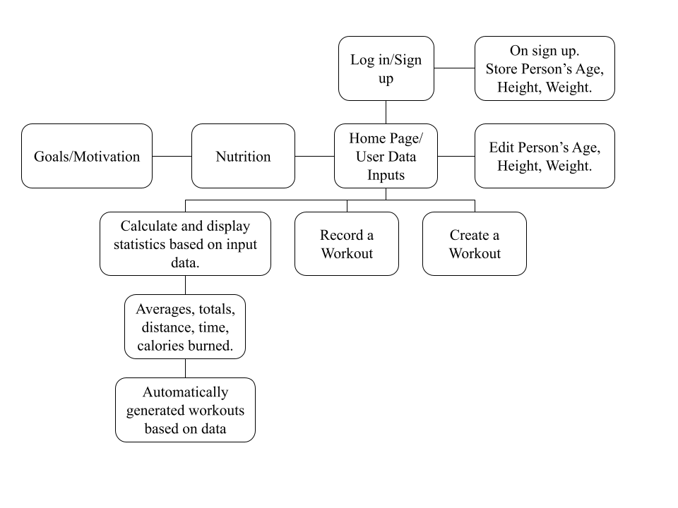
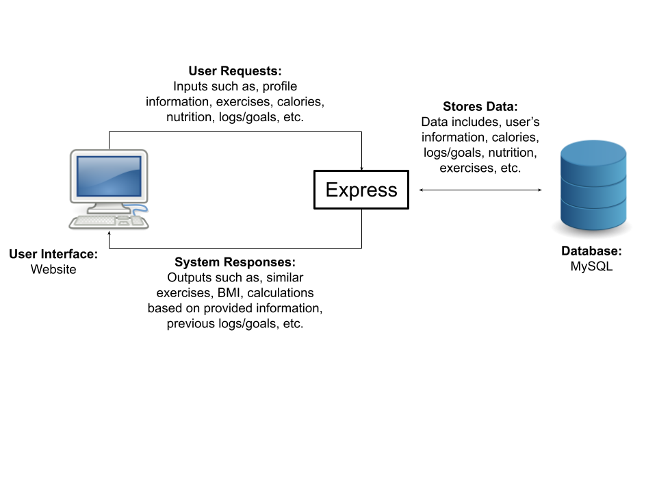

# Group1_ITSC-3155 - Git up Fitness Tracker
***
# Table of Contents
[1. Introduction](#introduction)\
[2. Problem Statement](#problem-statement)\
[3. Target Audience](#target-audience)\
[4. Requirements](#requirements)\
[5. Software Architecture](#software-architecture)\
[6. Technology Stack](#technology-stack)\
[7. MySQL Setup](#mysql-setup)\
[8. Angular Setup](#angular-setup)\
[9. Express Setup](#express-setup)
***
## Introduction:
Git up Fitness Tracker is a tool designed to help individuals track their physical activity and health in order to achieve their various fitness goals. The purpose of such an application is to help users maintain and improve their fitness levels by providing a platform for tracking and providing information based on inputed exercise data.

Objectives for our application are:
1. Tracking physcial activity: Allow users to log different types of activity (i.e. running, walking, cycling, swimming ect.) as well as provide tools for measuring/monitoring their progress
2. Monitoring health metrics: Allow users to track metrics related to their health such as calories, macronutrients, hours slept and weight in order to give users a holistic view of their overall health
3. Goal-setting and motivation: Allow users to set goals as well as display their progress twoards those goals as well as provide reminders and motivation

## Problem Statement:
Many people are overweight and cannot find time for proper execise into their lives. By using a fitness tracker to track their execises they can quickly see how they are improving and learn what they need to do. To combat America's obesity issue we need to use technology to fit it into our busy schedules.

## Target Audience:
The target audience for our application is anyone interested in monitoring and improving their physical health, including but not limited to Fitness enthusiasts, Beginners, and those seeking to loose weight.

## Requirements:
Create an account, log in and out of it. It must be able to save your data.

Receive records about health related fields and save them. Users will be able to create a workout and record data about it such ashow long they worked, the intesity and the kind of exercise. They will also be able to enter other importsant health statistics such as weight, age, and height.

Calculate statistics based on input data. The system will store each workout in an SQL table and keep track of the user's health data. It will total up distance, time and calories burned. It will also find avergaes and use the data to detemrine in what kind of health the user is in. 

Display user's health data and statistics in a clean visual way. 

Generate workout routines based on data and requests. The system will be able to use the data the user




## Software Architecture:
The System will require the user to log into the system first before allowing them to see the homepage. From there they can input their data and their exercise events. From the home page the user can navigate to the exercises page to view suggested workouts, as well as their logs, daily nutrition and goals. 

the Exercises page shows the user's past execise routines they've entered. They can then ask for a suggested routine based on a few parameters and their data.

The daily nutrition page is used to record daily caloric intake compared to their calories burned. 

Data logs shows users totals in their execizes such as total burned, total miles traveled etc. 

The User goals page allows users to set a week and month long goals. THis page will will track how close they are to completing the goals. 



## Technology Stack:
Angular - Front-end system framework to assist with the webpage design <br>
HTML/CSS - Markup Language to write the front-end <br>
Typescript - Language Angular uses. <br>
MySQL - Used to create the databases to hold all data. <br>
Express - Flexible web application framework to communicate between the front-end and database.


## Team Members:
1. Christan Hardin - Scrum Master
2. Tristan Elsener - Dev Team
3. Robert Salmon - Project Owner
4. Jeff Meendering - Dev Team
5. Dylan Sperry - Dev Team


***

# INSTRUCTIONS

## MySql Setup
To Begin, you must start with the database. In this application we are using a MySql database. Create the database using the files found in './angular/src/sql_scripts/' there you will find the schema file, and the dummy data (which you can then import). While doing this however, take some notes of the following information as they will be used later in the setup.

- Host (Required localhost, other untested)
- Port to access the database
- User (most likely root)
- password (root password)

## Angular Setup
Now its time to setup Angular. Depending on if you have previously installed Angular or other components, you may or may not have trouble completing this setup. If such a situation occurs you can contact me (Christan Hardin) and I will help you complete the setup. Otherwise, the setup below should work.

- Install node (and npm)
- Run the Following Commands
```
npm install -g @angular/cli
npm install --save-dev @angular-devkit/build-angular
npm install --save ng2-charts
npm install --save chart.js
```
If on windows run the following command after install in powershell:
```
Set-ExecutionPolicy -ExecutionPolicy RemoteSigned -Scope CurrentUser
```

At this point in time you should open up the angular folder in a terminal of your choosing and run the following command ```ng serve```, if you see the webpage building than everything should work correctly, otherwise, troubleshoot.

## Express Setup
After setting up Angular it is now time to setup the Express server. The Express Server is a Node.js application framework with tools that allow for the easy creation of REST APIs. To begin with the setup install the following packages:
```
npm install express mysql cors
```
After the installation of the above packages, open the file './express/server.js'. Within this file you will see the following:
```
const con = mysql.createConnection({
    host: "localhost",
    user: "root",
    password: "SuperSecretPassword",
    database:"github_db",
    port:"32700"
});
```

This is where you will fillout the data you saved from the [MySql Setup](#mysql-setup). This section of server.js is responsible for connecting to the database. So make sure the information here is correct.

After The data has been entered is is time to test the configuration. To do so navigate to the './express/ folder in a terminal of your choosing and execute the command: ```node server.js```. This command will start the Express Server. At this point if you dont see an error then you are good to go, otherwise, troubleshoot.

