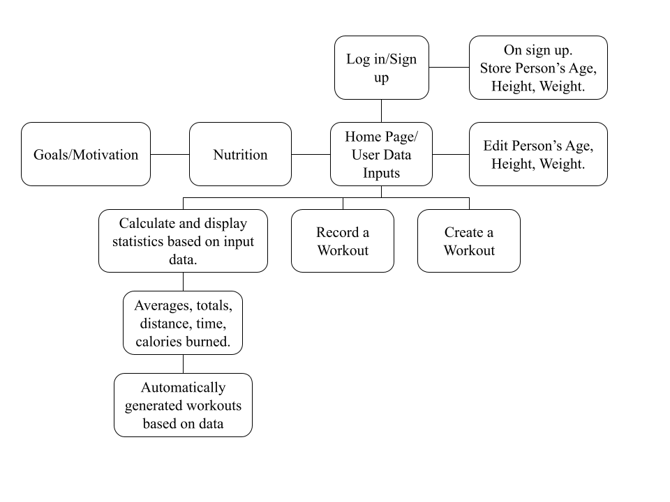
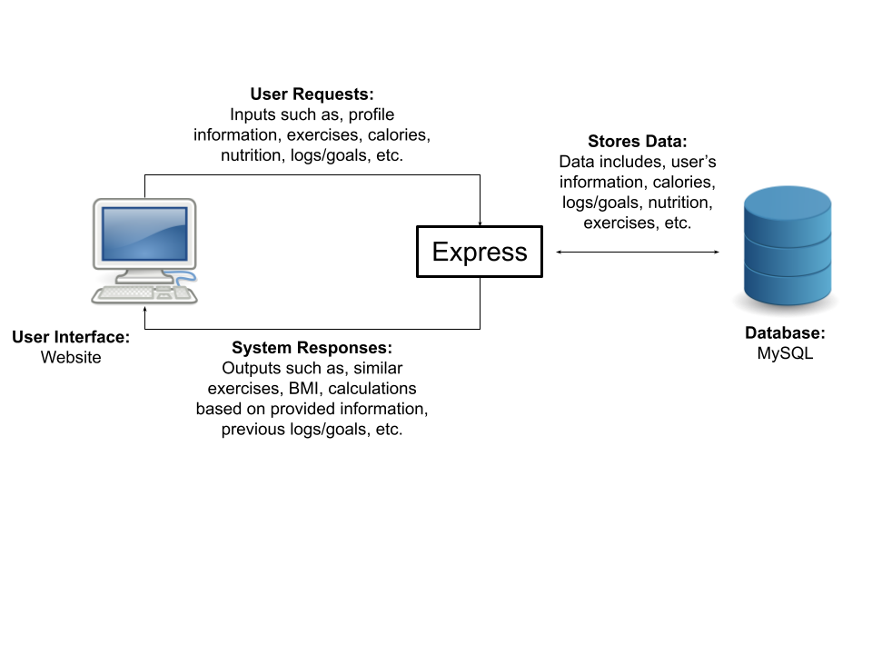

# Group1_ITSC-3155 - Git up Fitness Tracker

## Introduction:
Git up Fitness Tracker is a tool designed to help individuals track their physical activity and health in order to achieve their various fitness goals. The purpose of such an application is to help users maintain and improve their fitness levels by providing a platform for tracking and providing information based on inputed exercise data.

Objectives for our application are:
1. Tracking physcial activity: Allow users to log different types of activity (i.e. running, walking, cycling, swimming ect.) as well as provide tools for measuring/monitoring their progress
2. Monitoring health metrics: Allow users to track metrics related to their health such as calories, macronutrients, hours slept and weight in order to give users a holistic view of their overall health
3. Goal-setting and motivation: Allow users to set goals as well as display their progress twoards those goals as well as provide reminders and motivation

## Problem Statement:
Many people are overweight and cannot find time for proper execise into their lives. By using a fitness tracker to track their execises they can quickly see how they are improving and learn what they need to do. To combat America's obesity issue we need to use technology to fit it into our busy schedules.

## Target Audience:
The target audience for our application is anyone interested in monitoring and improving their physical health, including but not limited to Fitness enthusiasts, Beginners, and those seeking to loose weight.

## Requirements:
Create an account, log in and out of it. It must be able to save your data.

Receive records about health related fields and save them. Users will be able to create a workout and record data about it such ashow long they worked, the intesity and the kind of exercise. They will also be able to enter other importsant health statistics such as weight, age, and height.

Calculate statistics based on input data. The system will store each workout in an SQL table and keep track of the user's health data. It will total up distance, time and calories burned. It will also find avergaes and use the data to detemrine in what kind of health the user is in. 

Display user's health data and statistics in a clean visual way. 

Generate workout routines based on data and requests. The system will be able to use the data the user

## Software Architecture:
The System will require the user to log into the system first before allowing them to see the homepage. From there they can input their data and their exercise events. From the home page the user can navigate to the exercises page to view suggested workouts, as well as their logs, daily nutrition and goals. 

the Exercises page shows the user's past execise routines they've entered. They can then ask for a suggested routine based on a few parameters and their data.

The daily nutrition page is used to record daily caloric intake compared to their calories burned. 

Data logs shows users totals in their execizes such as total burned, total miles traveled etc. 

The User goals page allows users to set a week and month long goals. THis page will will track how close they are to completing the goals. 

## Technology Stack:
Angular - Front end system   
SQL - database to hold all data   
API Integration

## Team Members:
1. Christan Hardin - Scrum Master
2. Tristan Elsener - Dev Team
3. Robert Salmon - Project Owner
4. Jeff Meendering - Dev Team
5. Dylan Sperry - Dev Team

